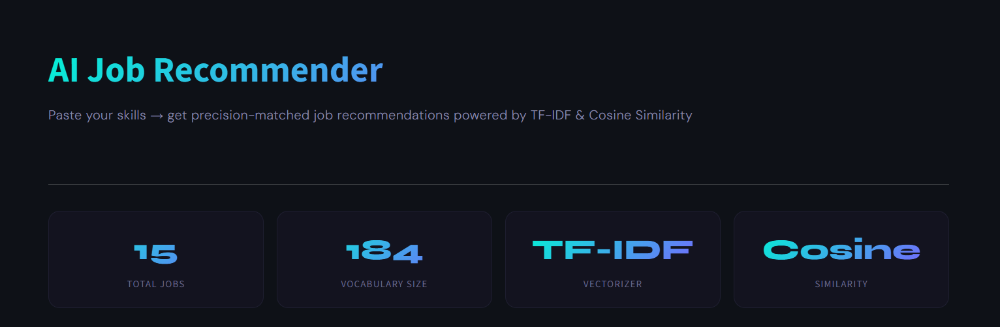
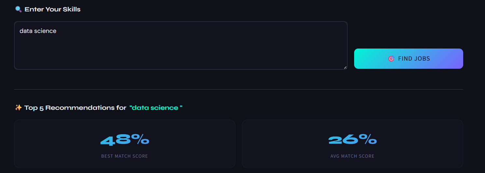
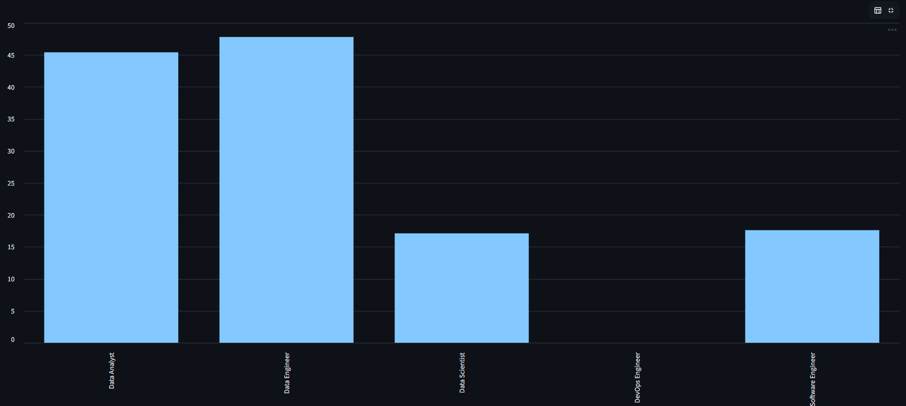
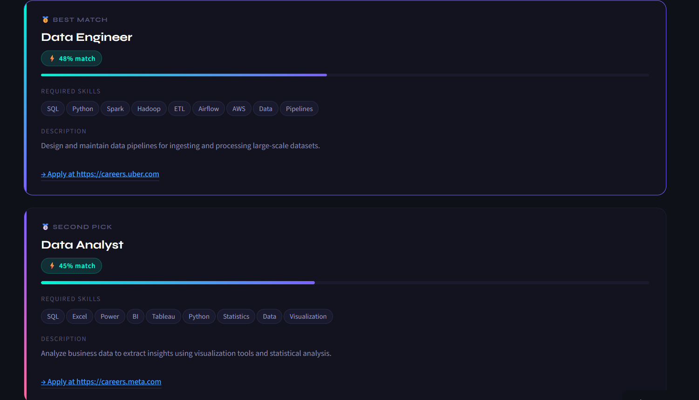

# 💼 AI-Powered Job Recommendation System

An intelligent Job Recommendation System built using NLP and Machine Learning techniques that recommends the most relevant jobs based on user skills.

This project uses TF-IDF Vectorization and Cosine Similarity to analyze job descriptions and recommend personalized job opportunities.

---

# 🚀 Live Demo

Check it link here:

```text
https://job-recommendation-system-madhu.streamlit.app/
```

---

# 📌 Project Overview

This project helps users:

✅ Find relevant jobs based on skills  
✅ Get personalized recommendations  
✅ Explore companies and job locations  
✅ View match scores  
✅ Access direct application links

The system compares user skills with thousands of job descriptions and recommends the most similar jobs.

---

# 🧠 How the Recommendation System Works

## Step 1 — User Enters Skills

Example:

```text
Python SQL Machine Learning Data Analysis
```

---

## Step 2 — Text Processing

Job descriptions and skills are cleaned and combined.

---

## Step 3 — TF-IDF Vectorization

Text is converted into numerical vectors using TF-IDF.

---

## Step 4 — Cosine Similarity

Cosine similarity compares user skills with job descriptions.

Jobs with higher similarity scores are recommended.

---

# 🛠 Technologies Used

| Technology        | Purpose               |
| ----------------- | --------------------- |
| Python            | Programming Language  |
| Pandas            | Data Processing       |
| Scikit-learn      | Machine Learning      |
| TF-IDF            | NLP Vectorization     |
| Cosine Similarity | Recommendation Engine |
| Streamlit         | Web Application       |
| GitHub            | Version Control       |

---

# 📂 Dataset

Dataset used:

US Technology Jobs on Dice.com

Dataset contains:

* Job Titles
* Company Names
* Skills
* Job Descriptions
* Job Locations
* Application URLs

Dataset Source:

[https://www.kaggle.com/datasets/PromptCloudHQ/us-technology-jobs-on-dicecom](https://www.kaggle.com/datasets/PromptCloudHQ/us-technology-jobs-on-dicecom)

---

# ✨ Features

## 🔍 Smart Job Recommendations

Recommends jobs based on user-entered skills.

---

## 📊 Match Score

Displays similarity percentage between user skills and jobs.

---

## 🏢 Company Filter

Filter recommendations by company.

---

## 📍 Location Filter

Filter recommendations by location.

---

## 🔗 Direct Apply Links

Users can directly open job application links.

---

## 🎨 Advanced Streamlit UI

Modern and interactive frontend using Streamlit.

---

# 🧮 Machine Learning Concepts Used

## TF-IDF Vectorization

Converts text data into numerical vectors.

---

## Cosine Similarity

Measures similarity between user skills and job descriptions.

---

# 📁 Project Structure

```text
AI-Job-Recommendation-System/
│
├── app.py
├── jobs.csv
├── requirements.txt
├── README.md
└── train.py
│
└── screenshots/
    ├── home_page.png
    ├── enter_skills.png
    ├── filters.png
    └── results.png
```

---

# ⚙ Installation

## Step 1 — Clone Repository

```bash
git clone https://github.com/your-username/AI-Job-Recommendation-System.git
```

---

## Step 2 — Open Project Folder

```bash
cd AI-Job-Recommendation-System
```

---

## Step 3 — Install Dependencies

```bash
pip install -r requirements.txt
```

---

## Step 4 — Run Streamlit App

```bash
streamlit run app.py
```

---

# 🖥 Application Screenshots
## Home Page

## Enter skills

## filter process

## Final Result


```

---

# 📈 Future Improvements

Planned improvements:

* Resume Upload Feature
* ATS Resume Matching
* Deep Learning Recommendations
* BERT Embeddings
* Salary Prediction
* Career Chatbot
* Hybrid Recommendation System

---

# 🎯 Resume Description

Developed an AI-powered job recommendation system using NLP and machine learning techniques. Implemented TF-IDF vectorization and cosine similarity to recommend personalized job opportunities based on user skills and job descriptions. Built and deployed an interactive Streamlit web application with advanced filtering and real-time recommendations.

---

# 💡 Key Learnings

Through this project, I learned:

* NLP Fundamentals
* Recommendation Systems
* TF-IDF Vectorization
* Cosine Similarity
* Streamlit Deployment
* Data Cleaning & Preprocessing
* Interactive Web App Development

---

# 📬 Contact

## Author

Madhukar Jeedi

LinkedIn:
www.linkedin.com/in/madhukarjeedi

GitHub:
https://github.com/MadhukarJeedi

---

# ⭐ If You Like This Project

Please give this repository a star ⭐ on GitHub.
